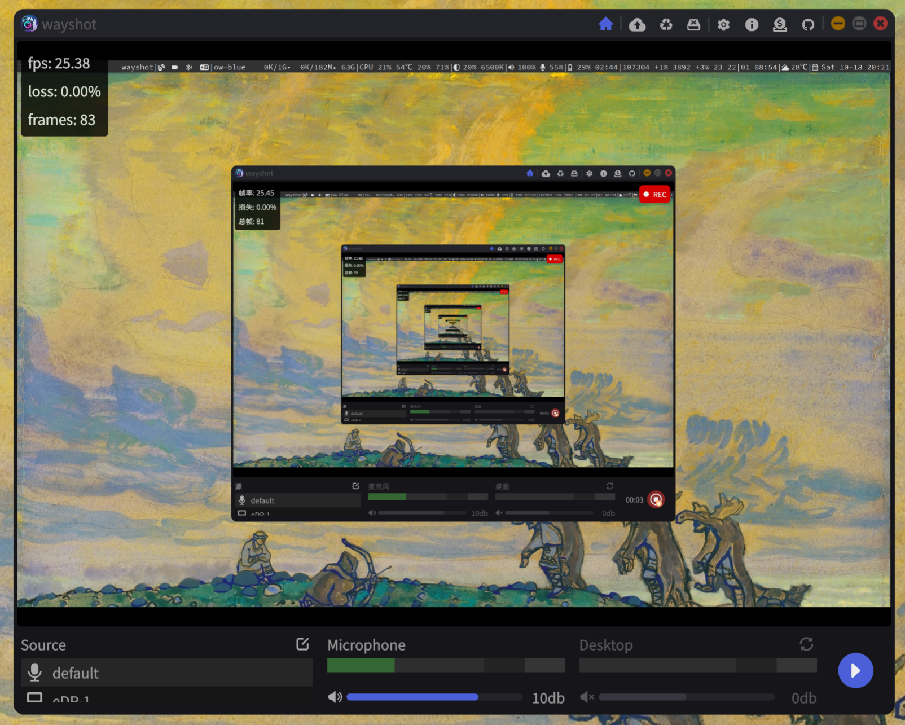

<div style="display: flex">
    
</div>

[中文文档](./README.zh-CN.md)

### Introduction
`Screen recording`, `Share screen` and `Push stream` tool, based on `Rust` and the `Slint` GUI framework. Support operating systems: `Windows` and `Linux`.

----

### Features
- Share screen via WebRTC
- Push stream via RTMP
- Single screen recording
- Single input device audio recording
- Capturing a single camera
- Supports camera background removal
- Desktop audio recording
- Microphone noise reduction
- Cursor tracking
- Manage recorded video history
- Play recorded historical videos
- Simple real-time image effects (right-click on recording interface to open)

----

### How to build?
- Install `Rust`, `Cargo`, `libpipewire`, `libalsa`, `libx264` and `QT6`

- Run `make desktop-debug` to run it on desktop platform

- Run `make desktop-build-release` to build a release version desktop application for wayland wlr. Likes: `Sway` and `Hyprland`.

- Run `make desktop-build-release desktop-features=desktop-wayland-portal` to build a release version desktop application for wayland xdg-desktop-portal. Likes: `Ubuntu` and `kde`

- Run `make desktop-build-release desktop-features=desktop-windows` to build a release version desktop application for `Windows`

- Run `make cursor-release` to build the program for fetching the cursor position. This program needs to be used together with the `portal` version of `wayshot`.

- Refer to [Makefile](./Makefile) for more information

----

### Troubleshooting
- Using the `Qt backend` can resolve the issue of fuzzy fonts on the Windows platform. It is also recommended to prioritize the `Qt backend` to maintain a consistent build environment with the developers.

- Check program output log information: `RUST_LOG=debug wayshot`。Available log level：`debug`, `info`, `warn`, `error`

- To use the cursor tracking feature with the `Wayland xdg portal` version, it needs to be used together with the `wayshot-cursor` program. The program can be downloaded from the Github page. The program must be run with administrator privileges: `sudo -E wayshot-cursor`. If you need to view logs, you can use: `RUST_LOG=debug sudo -E wayshot-cursor`. Available log levels: `debug`, `info`, `warn`, `error`

- Program version selection:
    - `portal` version: `Ubuntu` and `KDE`, etc.
    - `wlr` version: `Sway` and `Hyprland`, etc.

- Install build dependences on `Ubuntu` ：
    ```bash
    sudo apt install \
        libxcb-composite0-dev libasound2-dev libpipewire-0.3-dev \
        libx264-dev libx11-dev libxi-dev libxtst-dev libevdev-dev \
        qt6-base-dev qt6-tools-dev qt6-tools-dev-tools
    ```

- `Windows` dependences:
    - [ffmpeg](https://ffmpeg.org/download.html)

- `Windows` compiles [`ffmpeg-next`](https://github.com/zmwangx/rust-ffmpeg/wiki/Notes-on-building)
    - Install LLVM (through official installer, Visual Studio, Chocolatey, or any other means), and add LLVM's bin path to PATH, or set LIBCLANG_PATH to that (see clang-sys documentation for additional info).
    - Install FFmpeg (complete with headers) through any means, e.g. downloading a pre-built ["full_build-shared"](https://www.gyan.dev/ffmpeg/builds/) version from https://ffmpeg.org/download.html. Set FFMPEG_DIR to the directory containing include and lib.
    - cargo build.
    - Add FFmpeg's bin path to PATH
    - You can find an example in https://github.com/zmwangx/rust-ffmpeg/blob/master/.github/workflows/build.yml.
    - Program dependencies: `ffmpeg` related libraries and `libx264.dll`. You can download the program from the release page, which includes the necessary dependencies.
    - `git bash` examples：
    ```bash
    export FFMPEG_DIR=C:/ffmpeg-8.0.1-full_build-shared
    export LIBCLANG_PATH="C:/Program Files/Microsoft Visual Studio/18/Community/VC/Tools/Llvm/x64/bin"
    make desktop-build-release desktop-features=desktop-windows
    ```

----

### How to Configure `STUN` and `TURN` Servers
- Download and install [coturn](https://github.com/coturn/coturn)

- Generate certificate and key: `openssl req -x509 -newkey rsa:1024 -keyout /tmp/turn_key.pem -out /tmp/turn_cert.pem -days 9999 -nodes`

- Edit the configuration.
    - Default location: `/etc/turnserver.conf` or `/etc/coturn/turnserver.conf`

    - Example configuration:
    ```bash
    listening-ip=0.0.0.0
    listening-port=3478
    relay-ip=192.168.10.8
    external-ip=192.168.10.8

    tls-listening-port=5349
    cert=/tmp/turn_cert.pem
    pkey=/tmp/turn_key.pem

    realm=example.com

    lt-cred-mech
    user=foo:123456

    # no-auth
    no-cli
    verbose
    ```

- Testing
    - `turnserver -c /etc/turnserver.conf`
    - Test using [Trickle ICE](https://webrtc.github.io/samples/src/content/peerconnection/trickle-ice/)
    - `TURN` server address format: `turn:192.168.10.1:3478`

----

### Reference
- [Slint Language Documentation](https://slint-ui.com/releases/1.0.0/docs/slint/)
- [slint::android](https://snapshots.slint.dev/master/docs/rust/slint/android/#building-and-deploying)
- [Running In A Browser Using WebAssembly](https://releases.slint.dev/1.7.0/docs/slint/src/quickstart/running_in_a_browser)
- [github/slint-ui](https://github.com/slint-ui/slint)
- [Viewer for Slint](https://github.com/slint-ui/slint/tree/master/tools/viewer)
- [LSP (Language Server Protocol) Server for Slint](https://github.com/slint-ui/slint/tree/master/tools/lsp)
- [developer.android.com](https://developer.android.com/guide)
- [How to Deploy Rust Binaries with GitHub Actions](https://dzfrias.dev/blog/deploy-rust-cross-platform-github-actions/)

----

[](https://www.star-history.com/#heng30/wayshot&type=date&legend=top-left)
