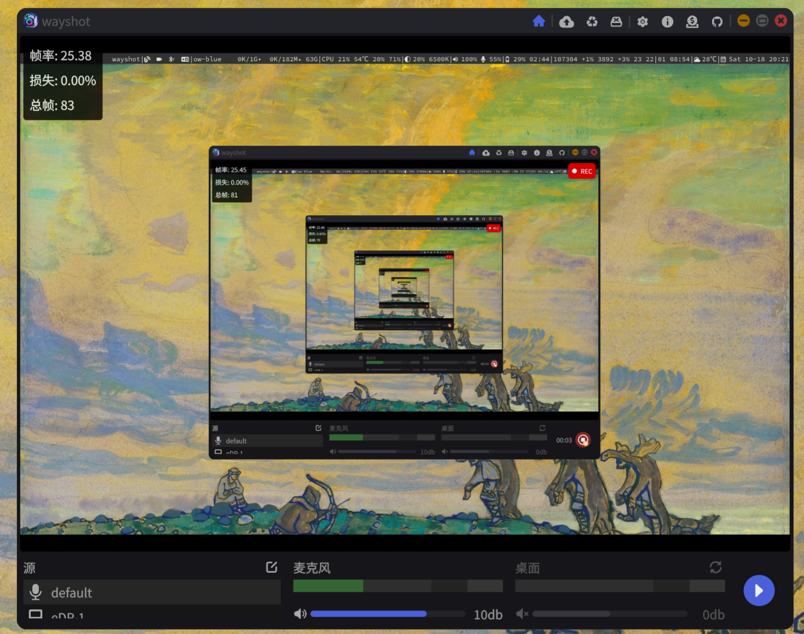

<div style="display: flex">
    
</div>

[English Documentation](./README.md)

### 简介
这是一个针对`Linux` `wayland`的录屏工具，使用`wlroots`扩展协议获取屏幕截图。常用的桌面环境：`sway`和`Hyprland`等。基于`Rust`和`Slint` GUI框架。

### 功能
- 单个屏幕录制
- 单个输入设备录音
- 桌面音频录制
- 麦克风降噪
- 光标跟随
- 管理录制视频历史
- 播放录制的历史视频

### 如何构建?
- 安装 `Rust`, `Cargo`, `libpipewire`, `libalsa`, `libx264` 和 `qt6`
- 运行 `make desktop-debug` 调试桌面平台程序
- 运行 `make desktop-build-release` 可构建适用于 `Wayland wlr` 的桌面应用程序发布版本。例如：`Sway` 和 `Hyprland`。
- 运行 `make desktop-build-release desktop-features=desktop-wayland-portal` 可构建适用于 `Wayland XDG` 桌面门户的桌面应用程序发布版本。例如：`Ubuntu` 和 `KDE`。
- 运行 `make cursor-release` 可构建获取鼠标位置的程序。该程序需要和 `portal` 版本的 `wayshot`一起使用。
- 参考 [Makefile](./Makefile) 了解更多信息

### 问题排查
- 使用`Qt后端`能解决windows平台字体发虚的问题。也推荐优先使用`Qt后端`保持和开发者相同的构建环境

- 查看程序输出日志信息：`RUST_LOG=debug wayshot`。可选日志级别：`debug`, `info`, `warn`, `error`

- `Wayland xdg portal`版本使用光标追踪功能，需要配合 `wayshot-curosr` 程序一起使用。程序可以到Github页面去下载。运行程序需要使用管理员权限：`sudo -E wayshot-cursor`。 如果需要查看日志可以使用：`RUST_LOG=debug sudo -E wayshot-cursor`。可选日志级别：`debug`, `info`, `warn`, `error`

- 程序版本选择版本:
    - `portal` 版本：`Ubuntu` 和 `KDE` 等
    - `wlr` 版本：`Sway` 和 `Hyprland` 等

- `ubuntu` 安装编译依赖：
    ```bash
    sudo apt install libxcb-composite0-dev libasound2-dev libpipewire-0.3-dev \
                     libx264-dev libx11-dev libxi-dev libxtst-dev libevdev-dev \
                     qt6-base-dev qt6-tools-dev qt6-tools-dev-tools

### 参考
- [Slint Language Documentation](https://slint-ui.com/releases/1.0.0/docs/slint/)
- [slint::android](https://snapshots.slint.dev/master/docs/rust/slint/android/#building-and-deploying)
- [Running In A Browser Using WebAssembly](https://releases.slint.dev/1.7.0/docs/slint/src/quickstart/running_in_a_browser)
- [github/slint-ui](https://github.com/slint-ui/slint)
- [Viewer for Slint](https://github.com/slint-ui/slint/tree/master/tools/viewer)
- [LSP (Language Server Protocol) Server for Slint](https://github.com/slint-ui/slint/tree/master/tools/lsp)
- [developer.android.com](https://developer.android.com/guide)
- [color4bg](https://www.color4bg.com/zh-hans/)
- [How to Deploy Rust Binaries with GitHub Actions](https://dzfrias.dev/blog/deploy-rust-cross-platform-github-actions/)
