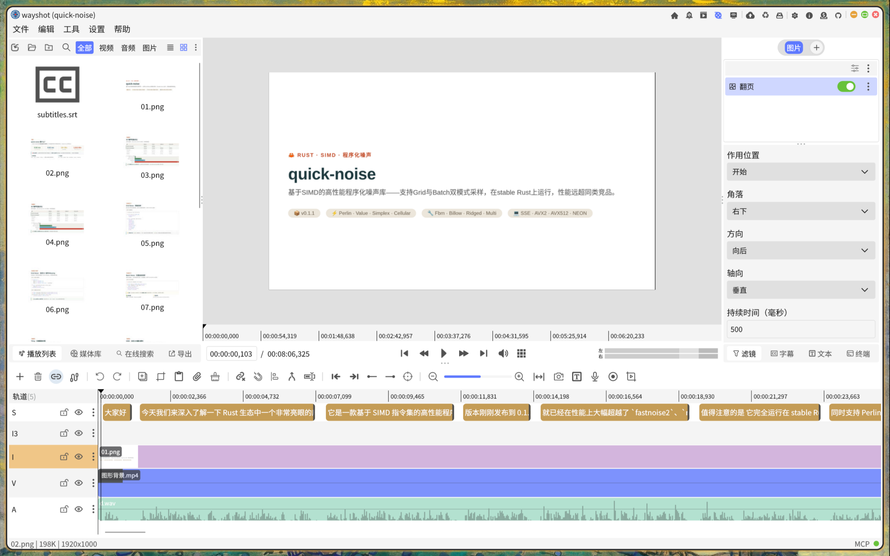
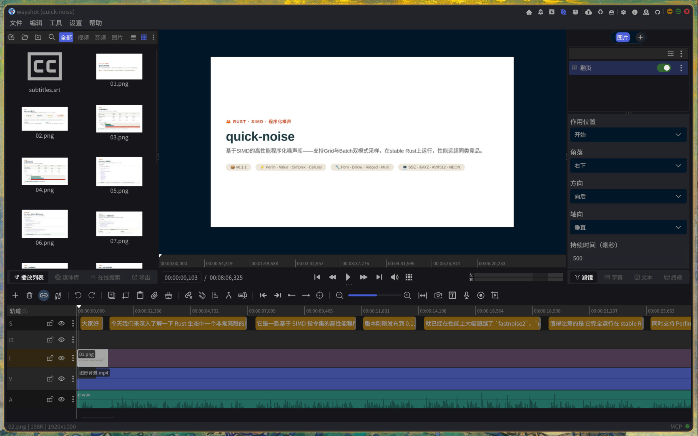

<p align="center">
  
  
</p>

<p align="center">
    <a href="https://github.com/heng30/wayshot/releases"></a>
    <a href="LICENSE"></a>
    <a href="LICENSE"></a>
    <a href="https://doc.rust-lang.org/edition-guide/rust-2024/"></a>
</p>

<p align="center">
  <strong>视频创作工具：视频编辑（大量AI辅助功能）、录屏、推流、屏幕共享。</strong>
</p>

<p align="center">
  <a href="README.md">English</a> | <a href="README.zh-CN.md">简体中文</a>
</p>


## 简介
这是一个**视频编辑**、**录屏**、**推流**和**屏幕共享**工具。基于 `Rust` 和 `Slint` GUI框架。适用的操作系统 `Linux` 和 `Windows`。

----

## 功能

### 录制功能
- 屏幕录制、光标跟随、录音（降噪）、捕获桌面音频、捕获摄像头、摄像头背景移除和实时图像滤镜
- 管理和播放录制的视频
- 屏幕共享（WebRTC）和RTMP推流

### 视频编辑

#### 时间轴与轨道
- 多轨道时间轴，支持5种轨道类型：视频、音频、字幕、图片、文本
- 轨道优先级自动排序：字幕 > 文本 > 视频/图片 > 音频
- 片段（Segment）操作：添加、插入、移动、复制、删除、分割、合并
- 片段裁剪：左/右边缘拖拽裁剪，拉伸延伸
- 轨道操作：添加、删除、移动、复制、锁定、隐藏、静音
- 智能对齐：片段边缘和播放头位置自动吸附
- 联动模式：单轨道联动、全轨道联动
- 一键移除间隙：移除片段间空隙，支持移除左侧/右侧/全部间隙
- 分离音频/字幕：从视频片段中提取音频或字幕到独立轨道

#### 撤销与重做
- 基于命令模式（Command Pattern）的完整撤销/重做系统
- 支持批量操作（原子性多命令组合）
- 历史记录上限可配置（默认1000步）

#### 视频滤镜（46种）
| 分类 | 滤镜 |
|------|------|
| 变换 | 变换（位置/缩放/旋转）、裁剪、翻转、缩放、速度、帧提取 |
| 转场 | 飞入（8方向）、淡入/淡出、滑动（4方向）、擦除（4方向）、精灵、翻页、分割 |
| 遮罩 | 线性遮罩、圆形遮罩、矩形遮罩、镜像遮罩 |
| 特效 | 色度键（绿幕）、暗角、鱼眼、波浪、颗粒噪点、老电影、素描、灰度、边缘检测、锐化、方向模糊、高斯模糊、呼吸动画 |
| 叠加 | 马赛克、画圆、画矩形、局部放大、放大镜、文本高亮、边框、背景、阴影、网格、设备边框、透明度 |
| AI/高级 | 聚焦、Live2D动画叠加、HSL调色 |

#### 音频滤镜（12种）
- 增益、淡入、淡出、标准化、静音（左/右/双声道）、声道复制、限幅器、噪声门、压缩器、变声、速度
- AI降噪（DeepFilter）

#### 全局滤镜（5种）
- 进度条、全局旋转、计时器/时钟、全局速度、弹幕叠加

#### 关键帧动画
- 支持对滤镜属性添加关键帧动画
- 数值类型：浮点数、二维坐标、颜色（RGBA）、布尔值
- 关键帧操作：添加、删除、移动、更新
- 时间轴上可视化关键帧标记，支持拖拽调整时间位置

#### 字幕编辑
- 手动添加/修改/删除字幕条目
- 字幕样式系统：字体、大小、颜色、边框、圆角、对齐方式、内外边距等
- 导出字幕：SRT、VTT、ASS 格式
- AI字幕翻译
- AI字幕去除（基于LaMa修复模型）

#### 文本叠加
- 文本叠加编辑器：内容、位置、旋转、透明度
- 字体选择、大小、颜色、轮廓、背景、边框、对齐
- 位置/旋转/透明度支持关键帧动画
- 预设文本样式保存与加载

#### 导出
- **视频导出**：MP4（H.264编码），支持x264/openh264/ffmpeg后端
  - 分辨率：原始、480P-4K、竖屏、方形、Instagram竖屏
  - 帧率：24/25/30/60 FPS
  - 质量预设：低/中/高/极高（CRF 28/23/18/15）
  - 音频：可配置声道数和采样率
  - 低内存模式
  - 字幕烧录
- **音频导出**：AAC、FLAC、MP3、OGG、WAV
- **字幕导出**：SRT、VTT、ASS
- 导出队列：支持多个导出任务并行，进度显示，可取消

#### 项目管理
- 项目文件保存/加载（JSON格式）
- 自动保存与崩溃恢复
- 最近项目列表
- 项目备注（Memo）
- 章节标记

#### AI工具
| 工具 | 说明 |
|------|------|
| 智能口播剪辑 | AI识别精彩片段，自动剪辑 |
| 智能混剪 | 三阶段AI流水线：语音转录→视觉识别→语义匹配，自动组合音视频 |
| 场景检测 | 自动检测视频场景边界 |
| 语音转录 | FunASR语音转文字 |
| 字幕翻译 | AI字幕翻译 |
| 字幕去除 | AI去除视频中的硬字幕/水印 |
| 背景移除 | AI抠图去背景 |
| 抠图 | AI目标抠图分割 |
| 去水印 | AI水印去除 |
| 画质增强 | AI超分辨率增强（SwinIR） |
| AI降噪 | DeepFilter音频降噪 |
| 音轨分离 | AI音乐分轨（人声/鼓/贝斯等） |
| 说话人分离 | AI说话人识别与分段 |
| OCR | 光学字符识别 |
| 文字转语音 | VoxCPM TTS语音合成 |
| AI音乐生成 | MusicGen音乐生成 |
| 相似视频检测 | 基于嵌入的相似视频片段检测 |
| 章节摘要 | AI生成视频章节摘要 |

#### 其他工具
- 背景动画（18种）：黑洞、散景、流场、流体、银河、故障、网格、墨水、万花筒、光线、矩阵雨、噪声流、粒子生命、粒子网络、形状、三角、波浪等
- 图片动画：箭头、评分标记、矩形绘制、滚动动画
- 代码转图片：代码语法高亮截图
- 纯色图片生成
- 长截图拼接
- 在线搜索图片和音频
- 编辑器内录音
- 元数据查看
- MCP服务器：通过Model Context Protocol暴露50+编辑器操作，支持AI Agent控制编辑器（AI操作效果不是很好，目前功能不完善）

#### 快捷键
- 项目：Ctrl+N/O/S/W/Q（新建/打开/保存/关闭/退出）
- 编辑：Ctrl+Z/Shift+Z（撤销/重做）、Ctrl+C/X/V（复制/剪切/粘贴）
- 时间轴：Space（播放/暂停）、S（分割）、M（合并）、Delete（删除）、Home/End（跳转）
- 工具：30+快捷键覆盖所有AI工具
- 面板：Alt+1/2/3/4切换左侧面板标签

----

## 如何构建?
- 安装 `Rust`, `Cargo` 和 `qt6`
- 运行 `make debug` 调试桌面平台程序
- 运行 `make build-release` 可构建适用于 `Wayland wlr` 的桌面应用程序发布版本。例如：`Sway` 和 `Hyprland`。
- 运行 `make build-release features=wayland-portal` 可构建适用于 `Wayland XDG` 桌面门户的桌面应用程序发布版本。例如：`Ubuntu` 和 `KDE`。
- 运行 `make build-release features=windows` 可构建适用于 `Windows` 的桌面应用程序发布版本。
- 运行 `make cursor-release` 可构建获取鼠标位置的程序。该程序需要和 `portal` 版本的 `wayshot`一起使用。
- 参考 [Makefile](./Makefile) 了解更多信息

----

## 问题排查
- 使用`Qt后端`能解决windows平台字体发虚的问题。也推荐优先使用`Qt后端`保持和开发者相同的构建环境

- 查看程序输出日志信息：`RUST_LOG=debug wayshot`。可选日志级别：`debug`, `info`, `warn`, `error`

- `Wayland xdg portal`版本使用光标追踪功能，需要配合 `wayshot-curosr` 程序一起使用。程序可以到Github页面去下载。运行程序需要使用管理员权限：`sudo -E wayshot-cursor`。 如果需要查看日志可以使用：`RUST_LOG=debug sudo -E wayshot-cursor`。可选日志级别：`debug`, `info`, `warn`, `error`

- 程序版本选择版本:
    - `portal` 版本：`Ubuntu` 和 `KDE` 等
    - `wlr` 版本：`Sway` 和 `Hyprland` 等

- `Ubuntu` 安装编译依赖：
    ```bash
    sudo apt install \
      libxcb-composite0-dev imagemagick libasound2-dev libpipewire-0.3-dev libx264-dev libx11-dev \
      libxi-dev libxtst-dev libevdev-dev libfontconfig-dev libavcodec-dev libavformat-dev libavutil-dev \
      libswscale-dev libavfilter-dev libavdevice-dev libssl-dev clang libclang-dev libx264-dev libx265-dev \
      libfdk-aac-dev libmp3lame-dev libopus-dev libvpx-dev libvorbis-dev qt6-base-dev qt6-tools-dev qt6-tools-dev-tools

- `Windows`编译依赖：
    - `Windows` 编译 [`ffmpeg-next`](https://github.com/zmwangx/rust-ffmpeg/wiki/Notes-on-building)
        - 安装LLVM（可通过官方安装程序、Visual Studio、Chocolatey或任何其他方式），并将LLVM的bin路径添加到PATH环境变量中，或者将LIBCLANG_PATH设置为该路径（更多信息请参阅clang-sys文档）。
        - 下载 [ffmpeg](https://ffmpeg.org/download.html) 和 [x264.dll](https://github.com/heng30/wayshot/tree/main/wayshot/windows/dll/libx264.dll)
        - 通过任意方式安装FFmpeg（需包含头文件），例如从 https://ffmpeg.org/download.html 下载预编译的["full_build-shared"](https://www.gyan.dev/ffmpeg/builds/)版本。将FFMPEG_DIR设置为包含include和lib的目录。
        - 将FFmpeg的`bin`路径添加到`PATH`环境变量中。
        - `git bash` 示例：
        ```bash
        export FFMPEG_DIR=C:/ffmpeg-8.0.1-full_build-shared
        export LIBCLANG_PATH="C:/Program Files/Microsoft Visual Studio/2022/Community/VC/Tools/Llvm/x64/bin"
        export PATH=$PATH:"C:/ffmpeg-8.0.1-full_build-shared/bin":"/path/to/x264.dll"
        make build-release features=windows
        ```

    - 设置QT依赖
        - [如何查找QT](https://docs.rs/qttypes/latest/qttypes/#finding-qt)
        - 安装`Qt6`，并将`qmake`所在的目录添加到`PATH`中: `export PATH=$PATH:"C:/Qt/6.11.1/msvc2022_64/bin"`

----

## 如何配置`STUN`和`TURN`服务器
- 下载和安装[coturn](https://github.com/coturn/coturn)

- 生成证书和密钥：`openssl req -x509 -newkey rsa:1024 -keyout /tmp/turn_key.pem -out /tmp/turn_cert.pem -days 9999 -nodes`

- 编辑配置。
    - 默认位置：`/etc/turnserver.conf` 或 `/etc/coturn/turnserver.conf`

    - 配置例子：
    ```bash
    listening-ip=0.0.0.0
    listening-port=3478
    relay-ip=192.168.10.8
    external-ip=192.168.10.8

    tls-listening-port=5349
    cert=/tmp/turn_cert.pem
    pkey=/tmp/turn_key.pem

    realm=example.com

    lt-cred-mech
    user=foo:123456

    # no-auth
    no-cli
    verbose
    ```

- 测试
    - `turnserver -c /etc/turnserver.conf`
    - 访问[Trickle ICE](https://webrtc.github.io/samples/src/content/peerconnection/trickle-ice/)进行测试
    - `TURN`服务器地址格式: `turn:192.168.10.1:3478`

----

## 参考
- [Slint Language Documentation](https://slint-ui.com/releases/1.0.0/docs/slint/)
- [github/slint-ui](https://github.com/slint-ui/slint)
- [Viewer for Slint](https://github.com/slint-ui/slint/tree/master/tools/viewer)
- [LSP (Language Server Protocol) Server for Slint](https://github.com/slint-ui/slint/tree/master/tools/lsp)
- [How to Deploy Rust Binaries with GitHub Actions](https://dzfrias.dev/blog/deploy-rust-cross-platform-github-actions/)

----

## 捐赠
<div style="display: flex; gap: 40px; justify-content: center; align-items: center; padding: 20px;">
  <div style="text-align: center;">
    
    <p>微信支付</p>
  </div>
  <div style="text-align: center;">
    
    <p>MetaMask（加密货币）</p>
  </div>
</div>
